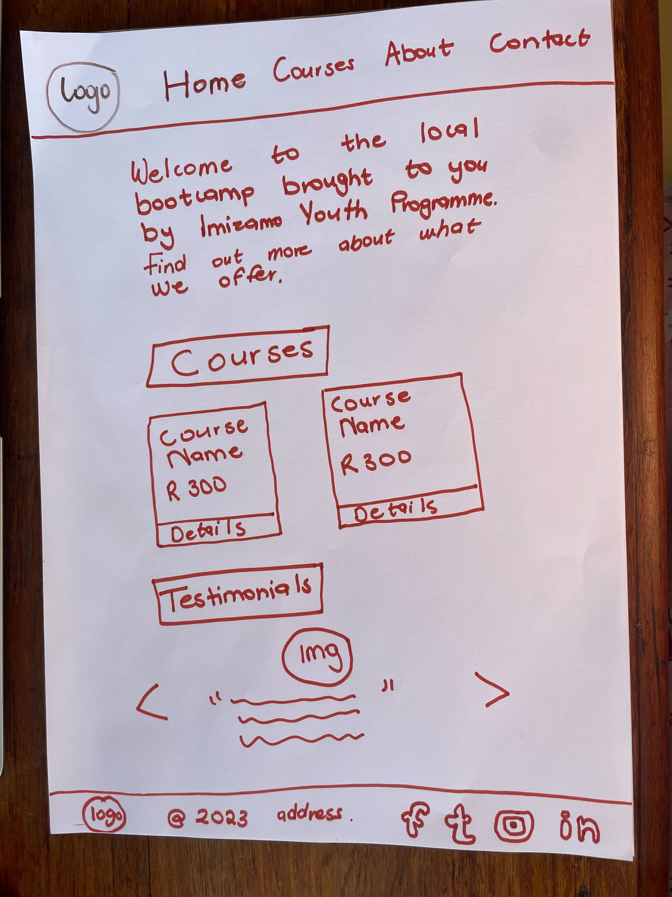

# Create a responsive home page

Create a responsive landing page using the [`./index.html`](./index.html) file.

**There are 5 sections:**
* Navigation section
* Intro section
* Course section
  * A minimum of 6 courses
  * add hover effect to reveal course information on the details button
* Testimonial section
  * A minimum on 3 testimonials
* Footer section

Use flexbox, floats or SimpleGrid to create the layout.

Ensure the landing looks like this for pages wider than 960px.

Add the appropriate container elements you might need to create the responsive landing page.

For smaller screens keep the default layout with all the text and images below each other. 

**Focus on layout and responsiveness**, if you want to add more styling. You can do that after you are done with all the other tasks.

